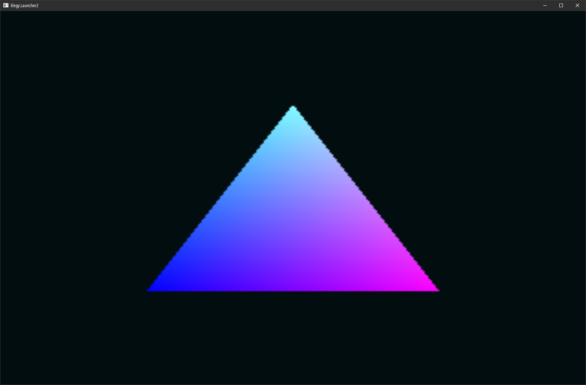
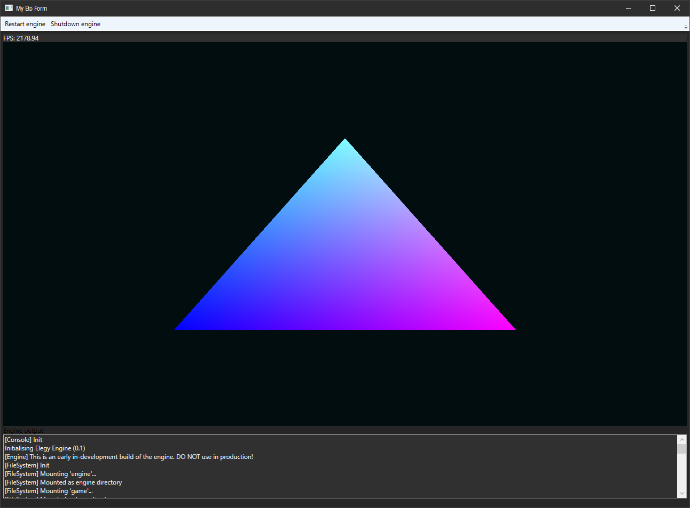
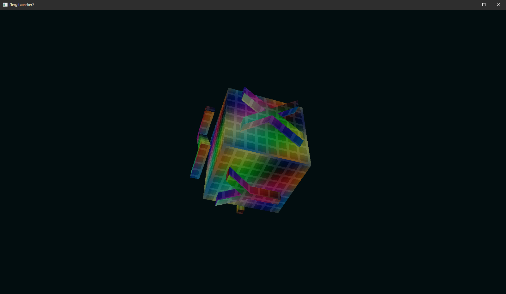
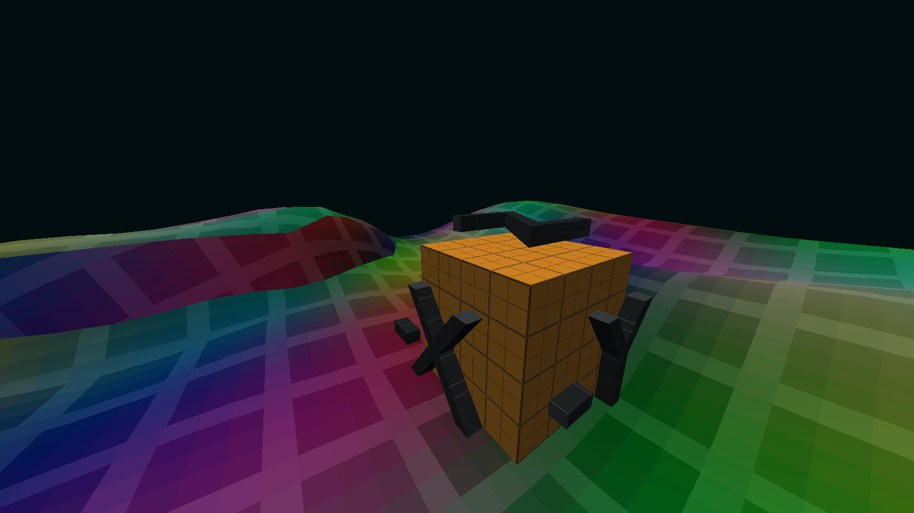
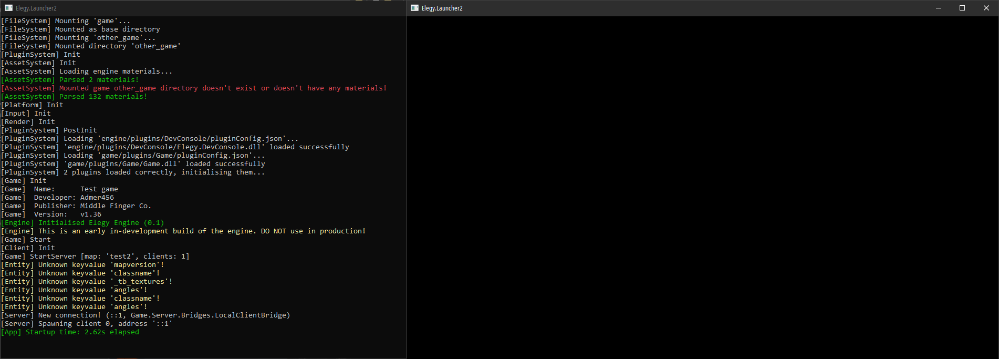
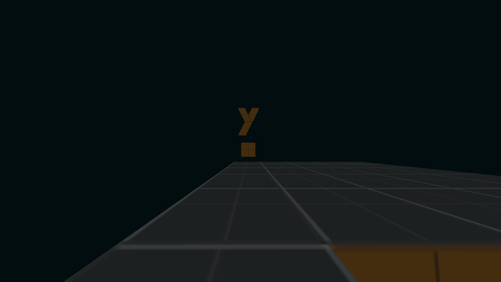
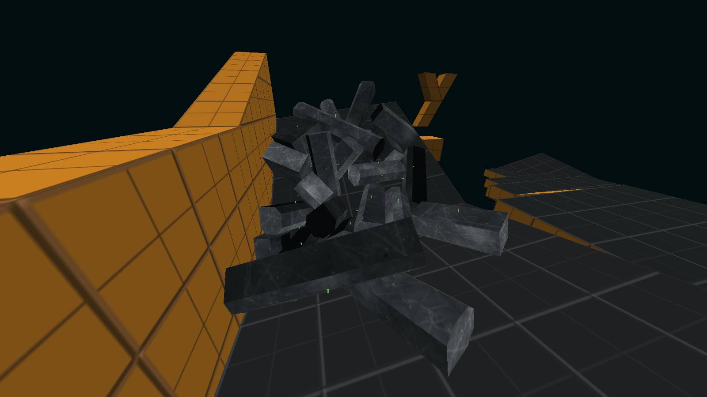

Hello! Welcome to the first ever progress report for Elegy, and a happy New Year! As I'm writing this, I hear fireworks non-stop. I've been writing very summarised versions of these [on Knockout](https://knockout.chat/thread/58267) for quite some time, but here I can go all out.

I'll be talking about all the stuff that happened in 2024. So, let's go chronologically.

<!--truncate-->

## January 2024

So, January was a very important month. That's when Elegy split off from Godot. I had to add various, various maths types and utilities to `Elegy.Common.Maths`, and `Elegy.Launcher2` was born. Here's some important commits from back then:
* [Engine: prepare for the new launcher](https://github.com/ElegyEngine/ElegyEngine/commit/959bf6c4941c653ee9c062be68323dc2fb3f72ad)
* [MapCompiler: catch up with all this](https://github.com/ElegyEngine/ElegyEngine/commit/f408e0301338d7d3b1afd1cacad5da9a56419311)
* [Remove Godot-specific extensions and EntryPoint](https://github.com/ElegyEngine/ElegyEngine/commit/a1eb1bc1acc92f968aca14c2796f397a160195d1)
* [Engine: upgrade to .NET 8](https://github.com/ElegyEngine/ElegyEngine/commit/2e8941a4f8f455a03b75979f4ecc023ebb2a58bf)

Elegy used to be on .NET 6 before all this! Right now it's on .NET 8 and, while .NET 9 looks attractive now, I think I'll stick to 8 until .NET 10. We'll see. But right now, I don't see much of a need to upgrade.

This is also when platform backends were introduced, so you could plug in any windowing/input backend if you implemented Silk.NET's interfaces for it! Back then it was just SDL2, but I've since added Eto.Forms and am working on Avalonia integration.

A ton of stuff from TestGame (now the game SDK) was also removed, because it just used so much of Godot's API, understandably so.

## February 2024

Truth is, when this switch happened, Elegy was basically left without a renderer, physics, audio, UI and so on. I began doing work on the render backend, the back-then render frontend idea (now-render styles), Eto.Forms integration (`GuiLauncher`) and so on.

I rendered a test triangle just to make sure stuff works and windows can be resized without Vulkan yelling at me:  
  
*Name's Triangle. Vulkan Triangle.*

The `no-godot` branch was finally merged on the 17th of February 2024. The renderer was starting to take shape.

## March 2024

This was another major month for Elegy. This is when `Elegy.ShaderTool` was born, we got `Standard` (renders 3D surfaces) and `Window` (renders framebuffers) shaders, and when the old [material templates](./2023-04-02-material-templates.md) idea started being implemented!

Work was done to enhance the build scripts, and it became a lot easier to work with the engine. Right now, it's still not entirely there. I'd like to build a project wizard eventually.

Most importantly, this was the month of the "big reorganisation", when Elegy got split up into modules. Before, it was just one big `Elegy.Engine.dll`, but now there are modules like `AssetSystem`, `PluginSystem` etc.

Other than that, I wrote a glTF model loader, added `IPluginCollector`, implemented a quadtree, cemented the asset system (model, texture & material 
management), and then I implemented a dummy & default render frontend.

  
*Eto.Forms, Silk.NET and Elegy walk into a fence.*

Soon after doing so, I realised I made a huge mistake in designing the render frontend API. Renderable objects, render meshes, render textures etc. were all interfaces, and each render frontend had to implement their own. Oh, the misery. Also every time I changed the API, because it was rapidly changing, I had to edit the interface, the dummy implementation and the existing implementation. Sometimes several implementations, e.g. the render frontend + mesh entity or whatever.

On the 30th of March, I also added fennecs, a delightful C# ECS library, as well as a "scratchpad" where I could do some experiments.

## April 2024

`Common` got upgraded to .NET 8 when Amara pointed it out. `Elegy.Bootstrapper` was born (now `Elegy.Framework`), and I went wild with source generators. The `Engine` API became static, and we got our own `IView` as to not rely on Silk's. 

`Elegy.AppTemplate` got added, `Bootstrap` got renamed to `Framework`, a new folder structure was set up (all engine systems went into "Modules"), and package info was added to all engine modules.

`ArrayMesh` got added, as well as `PngImageLoader`, and on the 14th of April, `RenderStandard` (the default render frontend) was able to load meshes and materials. No proper world renderer or anything yet though, I was just able to render an orientation cube.

  
*It's the missing texture texture!*

On the 22nd of April, Amara adapted `Elegy.MapCompiler` to use engine systems. This was a huge deal because we could finally get rid of a couple imitating systems in the compiler, and directly use the real deal!

## May 2024

Tons, tons of fixes and improvements to the material template system, and the engine was finally able to render meshes. Materials could now have global, per-instance, per-view and builtin material parametres. 2D support was added to `Mesh`, and I came up with the initial concept of a [world renderer](./2024-05-25-world-renderer.md).

On the 28th of May, we got rid of the whole render frontend API and moved all the render resource creation over to `RenderSystem`. Thank goodness. `IRenderStyle` was soon added. Soon enough, `Elegy.ShaderTool` got refactored as well as how material parametres worked, and binding material parametres to GPU resources internally became a ton simpler.

## June 2024

`RenderFrontend`-related stuff was completely gone at this point. `Elegy.RenderWorld` got added (now `Presentation.Renderer` in the game SDK), and various useful methods were added to things, like `Render.GetCurrentWindowView`.

Lots of bugfixes later, I also added the ability to load plugins' dependencies. This way, the game DLL was able to load fennecs, BepuPhysics later etc. Very big update.

I started rewriting the developer console application, and revived the old ECS scratchpad. The [entity system idea](./2024-06-14-entity-system.md) took form. The TrenchBroom config got updated for v2024. Looks like in 2025 I'll have to do the same for TrenchBroom v2025, given that it's changed a few keywords now.

Near the end of that month, I was also messing around with Docusaurus! That's how this website came to be, eventually.

## July 2024

A "tool mode" was added to the engine config, so it can optionally not load app plugins. Lots of changes were made to the map compiler, and matrix maths were added so we could create world matrices for entities and view matrices for cameras.

*The missing texture texture survived!*

The asset system received level loaders but also writers. glTF was now the new format for levels. The map compiler got a `-unitscale` parametre, plane & brush maths were fixed further, and that was basically it.

Near the end of the work, preparations began for the client-server model.

## August 2024

It started with the ECS. I spent a lot of time in the `EcsResearch` scratchpad project, experimenting with source generation and so on, trying to see how feasible it was to implement ideas from the [entity system post](./2024-06-14-entity-system.md).

## September 2024

Needless to say, I found a way.

Soon enough, work on the client-server model began, together with the concept of bridges. Vectors were added to `Parse` as well as `ReadOnlySpan` versions of `Parse.Float` and `Parse.TryFloat`. There was one small issue: the client-server model also had me delete the game SDK code where it uses the renderer to draw things, obviously, because there wasn't a "StaticModel" component yet.

  
*We're back to where we came from. Or are we just changing tyres?*

Source-style IO was added, entity events were added, a basic player controller was set up, `DeltaTimer` got added, the protocol was being implemented. We got various components too: Player, Transform, Entity, Worldspawn, Trigger, Breakable, and ultimately, `Elegy.TestGame` got renamed to `Elegy.Game`. This marked the start of a new era for Elegy, where concrete work was being done on the game SDK, and the engine's systems were enough to support some of it!

I say "some", because there still needed to be plenty changes to be done engine-side, but for the most part, a lot of systems have remained mostly untouched.

Around this time, the website was published, together with a few idea posts:
* [Hello world](./2024-06-10-hello-world.md)
* [Networking](./2024-09-17-networking.md)
* [Occlusion culling](./2024-09-27-vis.md)

## October 2024

More ideas were added:
* [Scripting](./2024-10-09-scripting.md)
* [UI](./2024-10-09-ui.md)

Eventually the website was separated into its own repository. The `Game` class got renamed to `GameImplementation`. Not a lot of *work* work was being done in this time period, but I was definitely thinking and writing stuff.

I also started working on API documentation generated from XML comments. I wrote a tool to transform Doxygen XML into Markdown for fun.

## November 2024

Minor code cleanup and optimisation of `ECS.Generator`. Nothing particularly notable here, except the website got a subdomain on my personal website: `elegy.microfox.dev`.

## December 2024

I started an experiment to redesign `Lexer` to use spans instead of strings. It turned out to use much less memory and performed 5x faster.

glTF models were flipped on the vertical axis, so I fixed that. `AssetCache` was added to the game SDK, `EntityWorld` was made static which made things a lot easier. The way entities were made was reworked to be more direct and robust.

  
*The initial orientation - Euler angles (0,0,0) - indeed points at +Y.*

`StaticModel` was added, together with the `ModelProperty` smart property, and we could soon render stuff again. Debug line rendering was added as well as dynamic meshes. Brush models got supported, `GuiLauncher2` was drafted.

Quaternion maths were added, and BepuPhysics started integration. Up until this point, the game SDK had no way to keep up with transform changes and vice-versa, so I added `ServerTransformListenEvent`. I'll have to refactor this later.

  
*Oh the mess.*

## Future work

So, what remains to be done?

On the engine side:
* Console variables
* Autocompletion facilities for CVars and console commands

On the map compiler side:
* Use double-precision coordinates for brush geometry
* Implement spatial partitioning
* Implement smooth normals

On the game SDK side:
* Input system with keybids
* Settings system
* HUD
* `OnPlayerUseEvent` - which will also need raycasting
* Triggers
* Player controller

So yeah, I'll need to do an in-game UI system. Also gotta look into animation and audio, and I'm pretty sure that's what I'll be working on throughout 2025, alongside occlusion culling and lightmapping. See ya next year!
